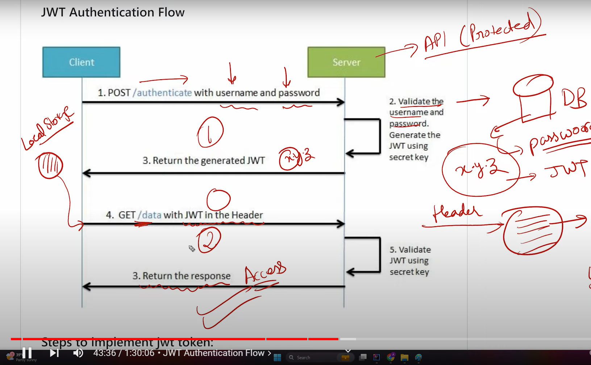

# Spring-Security Using JWT
## Introduction
1. JWT (Json Web Token) is a concept which consist of three components -
   1. Header (H)
   2. Payload (P)
   3. Signature (S)
2. In 'Header' we describe the type (typ) of token this is (which we recommend to always use "JWT"), and the ,
   algorithm used to sign the token.
3. In 'Payload' we will define the common fields like 'userName', 'Initialization / creation time', 'expiration 
   time', 'issuer' or any other custom fields like 'IP-Address of sender' or 'origin of request' anything else.
4. In 'Signature' we encrypt the header and payload using some algorithm and a secret key known by the application.
5. JWT looks like **H.P.S**.
6. Steps of encoding / JWT token generator-
   1. base64Header = base64Encode(header) **Encode the Header**
   2. base64Payload = base64Encode(payload) **Encode the Payload**
   3. signature = HS256(base64Header + '.' + base64Payload, 'super-secret') **Encode the Signature using a key**
   4. token = base64Header + '.' + base64Payload + '.' + signature **Send the token to user**
7. JWT official website - https://jwt.io/

## Advantage of Using JWT
1. No Need for user to send **userName and password** everytime when he want to authenticate or authorize himself to
   access any API or resource. He can simply send the JWT token to authenticate himself.
2. JWT is Stateless i.e. no need for server to store any information of the client, whatever info. is required to
   authenticate the client is already available in JWT Token, so no need to store / maintain state or anything in the
   session or in any kind of datastore.
3. Cross-Domain Use: JWTs can be used across different domains or applications. This is beneficial for single sign-on 
   (SSO) scenarios, where a user's authentication can be shared among multiple services. only those services should
   use the same secret key to sign the JWT token. So beneficial in case of **Microservice** architecture.

## Dis-Advantage of Using JWT
1. Token Size: While compactness is a pro, it can also be a con. If JWTs carry a lot of information, they can become 
   large, impacting network performance.
2. Revocation Difficulty: JWTs are valid until they expire, and they can't be invalidated before that time without 
   additional complexity. This can be problematic if you need to quickly revoke a user's access (LOGOUT scenario).

## JWT Flow Diagram

1. First whenever user will request any of our endpoint we will redirect him to our login page (from UI side) 
   where he needs to authenticate himself using userName and password.
2. Once the user will be authenticated, a JWT token will be generated in the backend using some secret key and
   the token will be provided in the response.
3. So the next time there is no need for user to provide his username and password if he wants to access any resource
   or endpoint from the backend.
4. To access any resource he will simply send JWT in his header along with the request and our backend code will
   validate that token only, on behalf of the validity of token user will be allowed to access corresponding 
   resources.

## JWT in Spring-boot
1. First we need to include below dependencies in our project -
```groovy
implementation 'io.jsonwebtoken:jjwt-api:0.11.5'
runtimeOnly 'io.jsonwebtoken:jjwt-impl:0.11.5'
runtimeOnly 'io.jsonwebtoken:jjwt-jackson:0.11.5'
```
2. Now we need to expose one endpoint where user will authenticate himself and we will generate a token for him.
   In our code API 'http://localhost:9090/DbUserHandling/getJwtToken' will first authenticate the user and then
   it'll generate the JWT token.
3. For authentication, we can use default authentication manager i.e. no need to define any bean in config class,
   or we can define an authentication manager bean in config class either way is fine -
```
@Bean
public AuthenticationManager authenticationManager(AuthenticationConfiguration configuration)
throws Exception {
   return configuration.getAuthenticationManager();
}
```
4. We need to create few users as well so here we created few InMemoryUsers in config class.
5. We also need a base64 encoded secret key that I generated using a code on website -
   https://cloud.google.com/storage/docs/samples/storage-generate-encryption-key#storage_generate_encryption_key-java
6. Now we are all set to generate one JWT Token so generate one token and send it back to user, now User will send
   this token to us to access any of our resource / services.
7. Now we need to make sure after providing JWT to the user we should first check the validity of the token and if
   the token is valid then only allow user to use our services. This can be achieved by extending 
   **'OncePerRequestFilter'**.
8. OncePerRequestFilter contains one method 
```
protected void doFilterInternal(HttpServletRequest request, HttpServletResponse response, FilterChain filterChain)
```
9. In this method only we need to write one logic to check the validity of the token. This method will execute once
   per every request made to our services i.e. whenever user will try to access any of our services then first 
   this method will execute and check the validity of the token and if the token is valid then only user is 
   allowed to access any of our services.
10. But when we are requesting our API to generate the JWT then at that time also we are not sending the JWT but
    still our API is running fine because in our config we provided that whatever the request coming for the url
    **"/DbUserHandling/getJwtToken"** permit all of them, we are authenticating them manually in the method / API
    itself then only we will generate the token. In this case also **'OncePerRequestFilter' will run** but the
    result of this class will be ignored by the spring boot.
11. We will also create one class 'JwtAuthenticationEntryPoint' which will implement **'AuthenticationEntryPoint'**
    interface i.e. whenever the JWT validation fails this class will be executed and the corresponding response
    will be sent to the user.
12. Now we prepared all the stuff needed to validate JWT now we need to tell spring boot that use those classes to
    validate the JWT using below config -
```
  @Bean
  public SecurityFilterChain securityFilterChain(HttpSecurity httpSecurity) throws Exception {
    httpSecurity
        .csrf(
            httpSecurityCsrfConfigurer ->
                httpSecurityCsrfConfigurer.ignoringRequestMatchers(
                    "/DbUserHandling/createNewUser", "/DbUserHandling/getJwtToken"))
        //        .cors(AbstractHttpConfigurer::disable)
        .authorizeHttpRequests(
            authorizeHttpRequest ->
                authorizeHttpRequest
                    .requestMatchers("/DbUserHandling/getJwtToken")
                    .permitAll()
                    .anyRequest()
                    .authenticated())
        .exceptionHandling(ex -> ex.authenticationEntryPoint(authenticationEntryPoint))
        .sessionManagement(
            session -> session.sessionCreationPolicy(SessionCreationPolicy.STATELESS))
        .addFilterBefore(jwtAuthFilter, UsernamePasswordAuthenticationFilter.class);
    //            .httpBasic(Customizer.withDefaults());
    return httpSecurity.build();
  }
```
13. In above configuration we clearly configured that allow all the request which are coming for generating JWT
    i.e. **'.requestMatchers("/DbUserHandling/getJwtToken").permitAll()'** apart from that validate each and 
    every request.
14. And for any of the request if JWT validation fails then run the code in **'AuthenticationEntryPoint'** class
    i.e. **'.exceptionHandling(ex -> ex.authenticationEntryPoint(authenticationEntryPoint))'**.
15. And our JWT Validation will run before **'UsernamePasswordAuthenticationFilter'** i.e.
    **.addFilterBefore(jwtAuthFilter, UsernamePasswordAuthenticationFilter.class);**.
16. Here we disabled the cors, our origin can be anything but if we want to restrict the origin then we need to
    do some config changes I don't know them now may be in future we will see.
17. After the implementation of JWT if we are getting an exception related to cyclic dependency then we nned to
    specify below property in application.yaml file -
```yaml
spring:
  main:
    allow-circular-references: true
```
   

